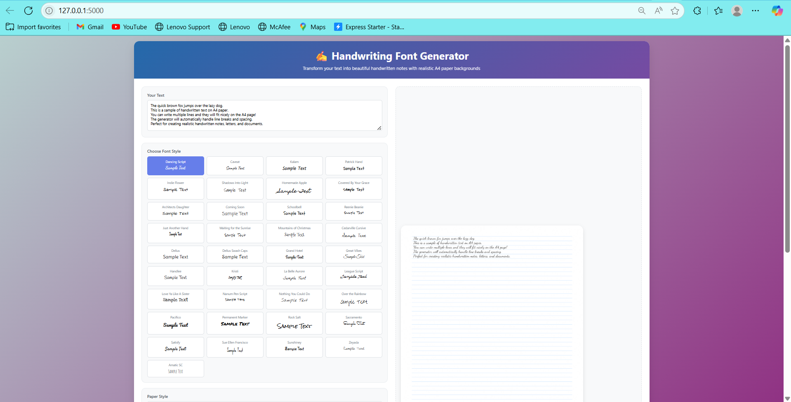
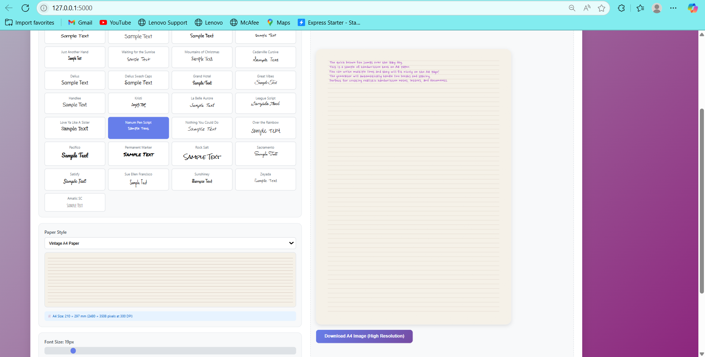

# ✍️ Text to Handwritten Converter

<div align="center">
  
  <h3>Transform digital text into realistic handwritten notes</h3>
</div>

<div align="center">

[](https://flask.palletsprojects.com/)
[](https://www.python.org/)
[](https://python-pillow.org/)
[](LICENSE)

</div>

## 📋 Overview

This Text to Handwritten Converter is a powerful tool that transforms digital text into realistic handwritten notes. With customizable handwriting styles, paper templates, and natural writing effects, it creates authentic-looking handwritten documents perfect for personal notes, creative projects, or educational materials.

## ✨ Features

### 🖋️ Handwriting Styles
- **30+ Fonts handwriting styles** including:
  - Casual scripts (Dancing Script, Caveat)
  - School-style (Patrick Hand, Schoolbell)
  - Artistic (Homemade Apple, Zeyada)
  - Marker-style (Permanent Marker)
- **Dynamic font downloading** - No local font installation required
- **Customizable font size** for different handwriting sizes

### 📝 Paper Templates
- **Multiple paper styles**:
  - Blank paper
  - Lined paper (multiple spacing options)
  - Notebook paper with margins
  - College ruled and wide ruled
  - Graph paper
  - Vintage aged paper
- **Realistic paper textures** with subtle imperfections
- **Customizable ink colors**

### ✍️ Natural Writing Effects
- **Character position variation** for organic look
- **Pressure variation** simulating real pen pressure
- **Line slant** for personal touch
- **Adjustable randomness** to control how "imperfect" the writing appears

### 🖼️ Output Options
- **High-quality PNG images**
- **Automatic sizing** based on content length
- **Database logging** of generated images

## 🚀 Quick Start

### Prerequisites
- Python 3.8+
- pip (Python package manager)

### Installation
```bash
# Clone the repository
git clone https://github.com/itsAksharaRathore/text-to-handwritten.git
cd text-to-handwritten

# Create and activate virtual environment
python -m venv venv
source venv/bin/activate  # On Windows use: venv\Scripts\activate

# Install dependencies
pip install -r requirements.txt

# Initialize database
python init_db.py

# Run the application
python app.py
```

Visit `http://127.0.0.1:5000` in your browser to start using the converter.

## 🛠️ How It Works

1. **Text Input**: Enter or paste your text into the input field
2. **Customization**:
   - Select from 40+ handwriting fonts
   - Choose paper style (lined, blank, graph, etc.)
   - Adjust font size, line spacing, and ink color
   - Fine-tune writing randomness and pressure variation
3. **Generation**: The system:
   - Downloads the selected Google Font (if not already cached)
   - Creates a paper background with your selected template
   - Renders each character with natural variations
4. **Output**: Download your generated handwritten image as PNG

## 🌟 Advanced Features

### Technical Implementation
- **Dynamic Font Handling**:
  - Downloads TTF files from Google Fonts on demand
  - Caches fonts locally for future use
- **Paper Texture Generation**:
  - Programmatically creates realistic paper textures
  - Adds subtle imperfections and aging effects
- **Natural Writing Simulation**:
  - Implements character position randomization
  - Simulates pen pressure with opacity variations
  - Adds natural line slant

### Database Integration
- Tracks all generated images with:
  - Timestamp
  - Font used
  - Template used
  - Output filename

## 📸 Screenshots

<div align="center">
  
  
</div>

## 📚 Documentation

### API Endpoints

- `GET /`: Main interface
- `POST /generate`: Generate handwritten image
  - Parameters:
    - `text`: The text to convert
    - `font`: Font name (default: "Dancing Script")
    - `fontSize`: Font size (default: 32)
    - `lineSpacing`: Line spacing multiplier (default: 1.5)
    - `inkColor`: Hex color for ink (default: "#1a1a1a")
    - `template`: Paper template name (default: "lined")
    - `randomness`: Writing imperfection level 0-1 (default: 0.3)
    - `pressureVar`: Pen pressure variation 0-1 (default: 0.2)

### Customizing Paper Templates

Edit the `PAPER_TEMPLATES` dictionary in `app.py` to add or modify paper styles. Each template can include:

```python
{
    "name": "Display Name",
    "lines": True/False,  # Whether to show lines
    "line_color": "#hexcolor",  # Color of lines
    "line_height": 40,  # Spacing between lines
    "color": "#hexcolor",  # Paper color
    "texture": True/False,  # Add paper texture
    "margin": True/False,  # Add left margin
    "margin_color": "#hexcolor",  # Margin line color
    "grid": True/False,  # For graph paper
    "grid_size": 20,  # Grid cell size
    "grid_color": "#hexcolor",  # Grid line color
    "aged": True/False  # Vintage/aged effect
}
```

## 🤝 Contributing

Contributions are welcome! Here's how:

1. Fork the repository
2. Create a feature branch (`git checkout -b feature/amazing-feature`)
3. Commit your changes (`git commit -m 'Add amazing feature'`)
4. Push to the branch (`git push origin feature/amazing-feature`)
5. Open a Pull Request

## 📜 License

This project is licensed under the MIT License - see the [LICENSE](LICENSE) file for details.

## 📬 Contact

For questions or feedback:

- **Email**: itsAksharaRathore@gmail.com
- **GitHub**: [ItsAksharaRathore](https://github.com/ItsAksharaRathore)
- **LinkedIn**: [Akshara Rathore](https://www.linkedin.com/in/itsAksharaRathore)

---

<div align="center">
  <p>Bringing the personal touch of handwriting to digital text ✍️</p>
</div>